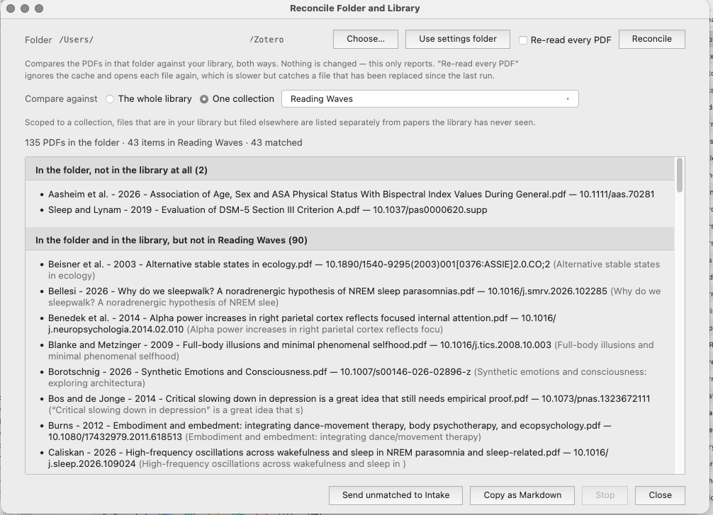
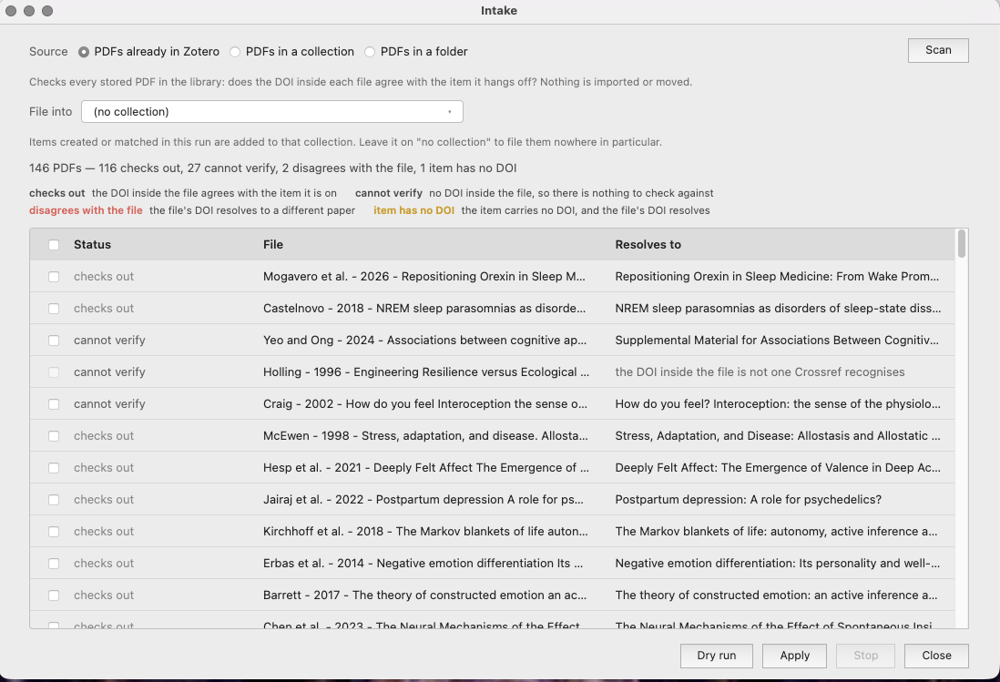
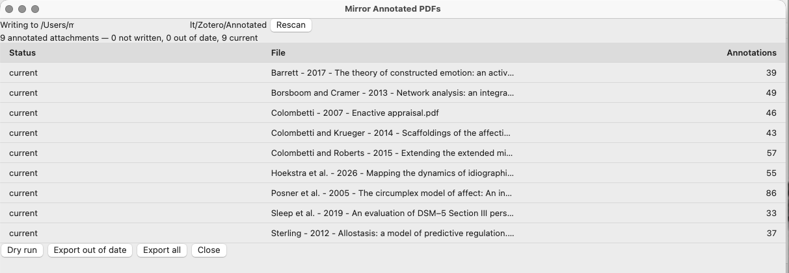

# Imprint

**A Zotero plugin that identifies papers by the DOI printed inside the PDF.**

- Import a folder of downloads accurately,
- Identify when a paper has been filed under the wrong item, and 
- Report the gaps between what's filed on your computer and what your library thinks it has.

For Zotero 9 and 10.
[Download the latest release](https://github.com/KateW11/zotero-imprint/releases).



---

## What it does

### Import a folder of downloads in one pass

*The problem: a folder of PDFs named `fpsyg-09-00282.pdf` and
`1-s2.0-S0010027718300398-main.pdf`.*

Imprint reads the DOI out of each file, looks it up,
and reports a table of findings. You tick the rows you want, pick a collection, and Imprint will: 

- creates the items,
- attaches the files,
- renames them to Zotero's convention
- moves the originals into your archive folder.

Unidentifiable items are listed, with the reason. 

### Check what Zotero has already filed

*The problem: a paper filed under the wrong item looks completely normal in
Zotero.*

Imprint compares every stored PDF against the DOI printed inside it and tells
you which ones agree, which ones disagree, and which ones carry no DOI it can
check. 

** Nothing else will find these, because there is nothing visibly wrong
with them. **. 

Imprint can: 

- fill in the blanks. 
- only ever adds and will not overwrite something you already entered.
- Check the whole library, or just one collection and its subcollections. 



### Export annotated PDFs in bulk

*The problem: Zotero keeps your highlights in its database, not in the file.
Back up your storage folder and you have backed up the papers and none of the
reading.*

Imprint 
- **writes copies** with the **annotations embedded** as standard PDF annotations (open in Preview, Acrobat, a tablet etc).
- Tracks which copies are out of date against the newest annotation on each paper (export changes only)
- Exports in Bulk



### Reconcile your folder against your library

*The problem: four questions that nothing answers together.*

| | |
|---|---|
| **In the folder, not in the library at all** | a paper you hold that Zotero has never been told about |
| **In the library, no copy in the folder** | an item with no local backup outside Zotero |
| **Attachment rows whose file is missing on disk** | it looks present in Zotero, opens to nothing, and will never appear on a phone. Zotero has no report of these |
| **Items with no PDF attached** | nothing to read on any device |

- Compare against the whole library or a single collection.
- Scoped to a collection, files that *are* in your library but filed elsewhere are listed separately, so the
- papers Zotero has genuinely never seen are listed separately

---

## Why not just use Zotero's own PDF metadata retrieval?

Zotero identifies a dragged PDF on import, and it is usually right. Nothing
tells you when it is wrong.

Imprint is stricter about what counts as evidence. It reads the DOI from inside
the file and resolves it at Crossref before accepting it. Where no DOI can be
read, it falls back to a bibliographic search under a real test — a title
similarity floor, year agreement, and a publication type that is actually an
article. A candidate that fails is reported, not accepted.

Two traps it was built to avoid, both found in a real library:

- **Journal-level DOIs.** Wiley and others stamp the *journal's* DOI in the PDF
  metadata. `10.1111/(ISSN)2044-8295` is *British Journal of Psychology*, not
  the paper in your hand. Accepting one files the wrong work and looks
  confident doing it.
- **Circular confirmation.** A file Zotero named from an item cannot be used to
  confirm that item. Only a DOI read from inside the file counts.

And two things Zotero has no equivalent for at all: bulk export of annotated
PDFs, and a report of attachment rows whose file is missing from disk.

---

## Guides

- [Your first import](docs/first-import.md) — install, settings, and a folder
  of downloads into Zotero, start to finish
- [Auditing a library you already have](docs/auditing-a-library.md) — finding
  papers filed under the wrong item
- [When it can't identify something](docs/when-it-cannot-identify.md) — what
  "needs you" and "cannot verify" mean, and what to do about each

## Install

1. Download `imprint.xpi` from the
   [releases page](https://github.com/KateW11/zotero-imprint/releases)
2. In Zotero: **Tools → Plugins**
3. Click the gear icon, then **Install Add-on From File…**
4. Choose the downloaded `.xpi`
5. Restart Zotero

Everything lives under **Tools → Imprint**.

## Settings

**Zotero → Settings → Imprint**

| | |
|---|---|
| New PDFs are dropped in | the folder Imprint imports from |
| Renamed PDFs are filed to | where identified files are moved, and what reconcile compares against |
| Annotated copies go to | where annotated exports are written. Blank means an `Annotated` subfolder of the folder above |
| Email for Crossref | optional; Crossref gives faster service to requests that identify themselves |

Caches live in an `imprint` folder inside your Zotero data directory. Delete
them any time — they exist only so a second run costs nothing.

## What it does not do

- It relies on Crossref, so it identifies what Crossref indexes. Books are
  indexed poorly and are deliberately not accepted on a title match alone.
- It reads text, so a scanned PDF with no text layer has no DOI to find. Those
  fall back to the filename search, and are reported when that fails too.
- It reaches Zotero's PDF engine through internal methods in order to read a
  file that is not in the library yet. These are checked for at runtime and
  there is a slower fallback, but a future Zotero release could change them.

## Development

Needs Node LTS.

```
npm install
npm start          # launches Zotero with the plugin, reloads on save
npm run build      # writes .scaffold/build/imprint.xpi
```

`npm start` needs a development Zotero profile and the path to the Zotero
binary, both set in `.env` — copy `.env.example` and fill it in. Create the
profile with `/Applications/Zotero.app/Contents/MacOS/zotero -P`. Point
`ZOTERO_PLUGIN_DATA_DIR` at a *copy* of a library if you want real items to
test against, never the live one.

Test an installed build, not just the development one — some problems only
appear on a cold start.

## Licence

AGPL-3.0-or-later. The project structure derives from
[zotero-plugin-template](https://github.com/windingwind/zotero-plugin-template)
by windingwind, which is AGPL.

Named for the publisher's mark inside a book, because that is what it reads.
