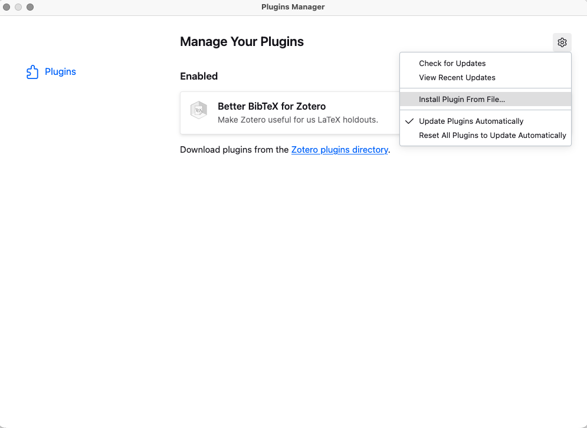
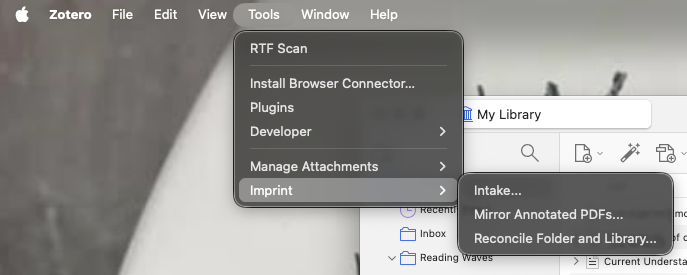
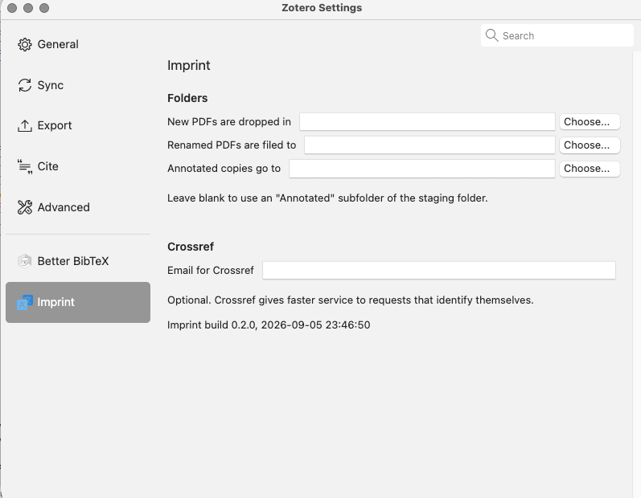

# Your first import

Taking a folder of downloaded PDFs and getting them into Zotero, named and
filed. About ten minutes the first time.

## 1. Install

1. Download `imprint.xpi` from the
   [releases page](https://github.com/KateW11/zotero-imprint/releases)
2. In Zotero, click **Tools**, then **Plugins**
3. Click the **gear icon** at the top right of the Zotero Plugins window
4. Click **Install Add-on From File…**
5. Choose the `.xpi` you downloaded, then click **Open**
6. Quit Zotero completely with **Cmd + Q** (or **Alt + F4** on Windows) and
   open it again

Everything the plugin does is under **Tools → Imprint**.

## 2. Tell it where your folders are

Click **Zotero** in the menu bar, then **Settings**, then **Imprint**.

**New PDFs are dropped in** — the folder you download papers into. Imprint
reads from here and moves files out of it once they are in Zotero.

**Renamed PDFs are filed to** — where those files end up. This is your archive
of the papers themselves, separate from Zotero's own copy, and it is what the
reconcile report compares your library against.

Those two must be different folders. Everything else can wait: the mirror
folder defaults sensibly, and the Crossref email is optional.

> **A note on macOS folders.** Terminal and some tools are blocked from
> Desktop, Documents and Downloads until you grant access. The plugin runs
> inside Zotero and is not affected, but if you use scripts alongside it, a
> folder in your home directory avoids the problem entirely.

## 3. Put some PDFs in the source folder

Download a few papers as you normally would, into the folder you set as **New
PDFs are dropped in**. Their filenames do not matter — `fpsyg-09-00282.pdf` is
fine. Imprint reads the DOI printed inside each file, not the name.

## 4. Look before you leap

1. Click **Tools**, then **Imprint**, then **Intake…**
2. Set **Source** to **PDFs in the source folder**
3. Click **Scan**

Every file is read and looked up. Nothing has been written yet.

You get one row per PDF:

| Status | What it means |
|---|---|
| **new** | identified, and your library has no such item — one will be created |
| **attach** | your library has this paper without a PDF — the file will be attached to it |
| **already has PDF** | your library has this paper with a PDF already — skipped |
| **needs you** | nothing confident enough to act on. Left alone, with the reason |

The **New name** column is editable — click into it and change anything you
don't like. Untick any row you want left out.

If you want everything filed into a collection, pick it under **File into**.

## 5. Dry run, then apply

Click **Dry run**. It reports exactly what it would do and writes nothing —
read it.

If it says the right things, click **Apply**. Imprint creates the items,
attaches each file, renames it to Zotero's own convention, and moves the
original into your archive folder.

## 6. Check it

Do not take the summary counts at face value:

- Your source folder should be empty, or hold only the rows you excluded
- Your archive folder should hold the imported files under their new names
- The new items in Zotero should have authors, a year and a PDF each

Then click **Tools → Imprint → Reconcile Folder and Library…** and click
**Reconcile**. If the import went cleanly, the first two sections will be
short or empty.

## What if it gets something wrong?

Nothing here is one-way. Zotero's own **Edit → Undo** covers the items it
created. The files it moved are in your archive folder under their new names,
and the plugin keeps a record of every move in an `imprint` folder inside your
Zotero data directory.
